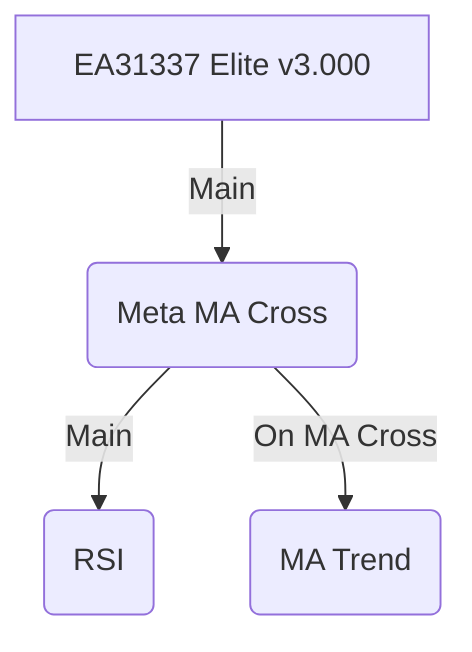
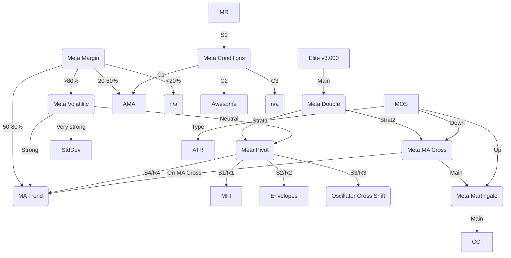

# Elite

## Configuration

### Default

```mermaid
graph TD
    E[EA31337 Elite v3.000] -->|Main| M(Meta MA Cross)
    M --> |Main| S1(RSI)
    M --> |On MA Cross| S2(MA Trend)
```

### Recommended

```mermaid
graph TD
    EA[Elite v3.000] -->|Main| MD(Meta Double)
    MD --> |Strat1| MP(Meta Pivot)
    MD --> |Strat2| MMC(Meta MA Cross)

    MM(Meta Margin) --> |>80%| MV(Meta Volatility)
    MM --> |50-80%| MAT(MA Trend)
    MM --> |20-50%| AMA
    MM --> |<20%| NA1(n/a)

        MV --> |Neutral| MP(Meta Pivot)
        MV --> |Strong| MAT(MA Trend)
        MV --> |Very strong| StdDev

            MP --> |S1/R1| MFI
            MP --> |S2/R2| Envelopes
            MP --> |S3/R3| OCS(Oscillator Cross Shift)
            MP --> |S4/R4| MAT(MA Trend)

                MR --> |S1| MC(Meta Conditions)

                    MC --> |C1| AMA
                    MC --> |C2| Awesome
                    MC --> |C3| NA2(n/a)

    MMC --> |Main| MMG(Meta Martingale)
    MMC --> |On MA Cross| MAT(MA Trend)

        MMG --> |Main| CCI

    MOS --> |Type| ATR
    MOS --> |Down| MMC(Meta MA Cross)
    MOS --> |Up| MMG(Meta Martingale)
```
